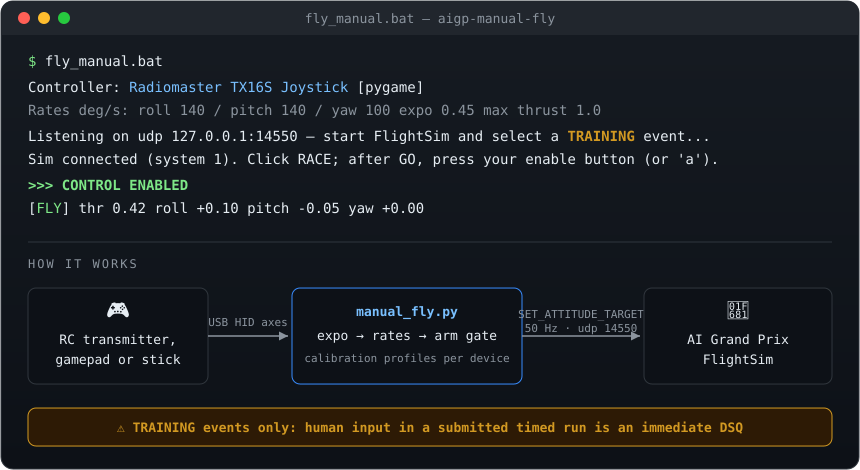

# aigp-manual-fly

[](LICENSE)
[](https://www.python.org/)
[](#setup)

Fly the **AI Grand Prix FlightSim by hand** — with an RC transmitter, gamepad, or
flight stick — over the same local MAVLink interface your autonomous pilot uses.

<p align="center">
  
</p>

Great for getting a feel for the drone's dynamics, scouting a course line before
writing a planner, or just having fun on the training tracks.

> ### ⚠️ TRAINING EVENTS ONLY
> Per the official rules, **any human input during a submitted timed run is an
> immediate DSQ** — and the sim uploads run records automatically. Only ever use
> this with a **"… - TRAINING"** event selected. The SUBMISSION entry usually sits
> directly above TRAINING in the menu: look twice, click once.

## Setup

Requires Windows (the sim is Windows-only) and Python 3.10+.

```bat
git clone https://github.com/jeromtom/aigp-manual-fly.git
cd aigp-manual-fly
fly_manual.bat --setup      # one-time: creates venv, installs deps, runs stick calibration
```

`fly_manual.bat` (no args) then starts the bridge. Launch `FlightSim.exe`, log in,
pick a **TRAINING** event — the bridge prints "Sim connected". Click RACE; after
**GO**, press your enable button and fly.

## Supported controllers

Anything Windows sees as a joystick. Built-in mappings:

| Device | Notes |
|---|---|
| RC transmitters — Radiomaster, FrSky Taranis, Jumper, BetaFPV, Spektrum, FlySky (EdgeTX/OpenTX USB-joystick mode) | AETR channel order assumed; the wizard fixes any custom order |
| Xbox / XInput pads (incl. Logitech F310/F710 on **X** switch) | Mode 2: left = throttle/yaw, right = roll/pitch; center throttle ≈ hover |
| PlayStation DualShock 4 / DualSense | Same Mode-2 layout |
| Logitech Extreme 3D Pro / Thrustmaster sticks | Twist = yaw, slider = throttle |
| Anything else | Run `fly_manual.bat --setup` — 60-second interactive calibration, saved per device |

`fly_manual.bat --list` shows detected devices; `--device N` picks one;
`--setup` recalibrates (mappings persist in `profiles.json`).

## Tuning feel

Defaults are gentle trainer rates. Racing feel: `--rate-rp 540 --rate-yaw 360 --expo 0.3`.

| Flag | Default | Meaning |
|---|---|---|
| `--rate-roll` / `--rate-pitch` / `--rate-yaw` | 140 / 140 / 100 | max deg/s at full stick (`--rate-rp` sets both) |
| `--expo` | 0.45 | softer stick center (0–0.8) |
| `--max-thrust` | 1.0 | thrust ceiling — try 0.4 while learning |
| `--hover` | 0.18 | center-stick thrust on springy (gamepad) sticks |
| `--linear-throttle` | off | plain 0..1 throttle even on a gamepad stick |
| `--pitch-fwd-up` | off | reverse pitch convention |

The sim is pure **ACRO** (rate control): a tilt stays until you counter-stick it.
If you're new, start with throttle+yaw hovers, then small pitch/roll taps.

## How it talks to the sim

- Binds `udpin:127.0.0.1:14550`; the sim transmits from `14560` (client-side ports
  are what the docs list — no config needed).
- Streams `SET_ATTITUDE_TARGET` (`type_mask=128`: body rates rad/s + thrust 0–1)
  at 50 Hz, heartbeats at 2 Hz. `SET_POSITION_TARGET_LOCAL_NED` is ignored by the
  sim — rate commands are the only control path.
- Nothing else: no telemetry parsing needed for manual flight (you're watching the
  sim window), no network beyond localhost UDP.
- Only one client can bind 14550 — don't run your AI pilot at the same time.

## Troubleshooting

- **Controller not detected**: transmitters must be in USB *joystick* mode (EdgeTX:
  plug in USB → select "USB Joystick (HID)"). Gamepads: press a button after plugging in.
- **Logitech F310/F710 dead, Device Manager shows error code 28**: set the front
  switch to **X**, replug. If it persists, Windows may have cached a bad descriptor
  query — delete `HKLM\SYSTEM\CurrentControlSet\Control\usbflags\046DC21F0305`
  (as admin), remove the device node, replug. It then binds the in-box Xbox 360 driver.
- **Sticks reversed / wrong axes**: `fly_manual.bat --setup`.
- **"Sim connected" never appears**: start the bridge *before* clicking into the
  event, and make sure nothing else is bound to UDP 14550.

## Community

Join the **AIGP Paddock** — the unofficial Discord for AI Grand Prix participants.
Tips, course lines, setup help, and post-race chat:
**[discord.gg/kBrhdManb6](https://discord.gg/kBrhdManb6)** · [ai-gp-paddock.rexindynamics.com](https://ai-gp-paddock.rexindynamics.com)

## License

MIT — see [LICENSE](LICENSE). Not affiliated with the AI Grand Prix organizers;
use at your own risk and always within the official rules.
